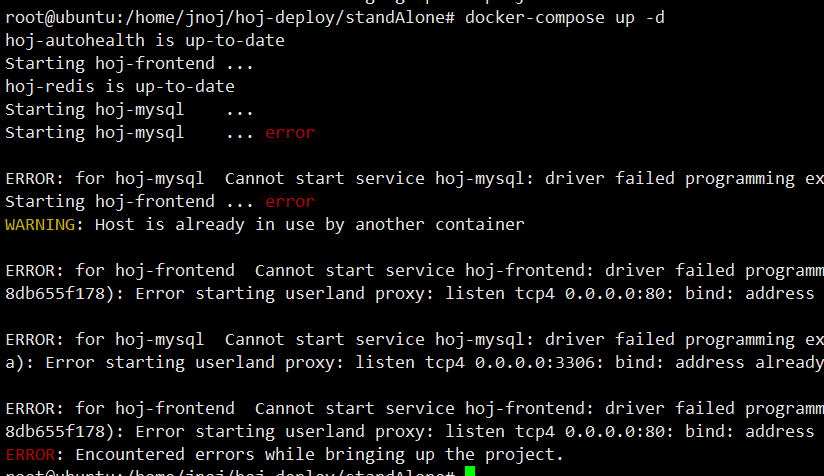

# 常见问题FAQ

!!! note

    问题及对应的链接：

    - [一、部署在Centos7系统中无法正常评测，如何解决？](/deploy/faq/#一、部署在centos7系统中无法正常评测-如何解决)
    - [二、部署时出现3306或80、443等端口号被占用](/deploy/faq/#二、部署时出现3306或80、443等端口号被占用)
    - [三、如何修改MySQL、Redis、Nacos的密码？](/deploy/faq/#三、如何修改mysql、redis、nacos的密码)


## 一、部署在Centos7系统中无法正常评测，如何解决？

#### 1. 问题引用

- 原HOJ仓库issue引用：[本地构建没问题 centOs 7 下构建报如下错误](https://gitee.com/himitzh0730/hoj/issues/I5HZNP)

- `hoj-judgeserver`容器一直重启，`docker logs hoj-judgeserver`查看日志发现，启动Go-judge（Sandbox）报错：`prefork environment failed container: failed to start container fork/exec /proc/self/exe: invalid argument`

  

####  2. 如何解决

**Tips：其实强烈建议换Ubuntu系统，但如果一定要使用CentOS7系统的话请看下面。**

由于hoj使用的判题机中的安全沙盒使用环境的特殊性，如果想在centos7系统中正常运行`hoj-judgeserver`服务，需要开启 user 命名空间来使用。

- 永久性设置操作

  ```shell
  echo user.max_user_namespaces=10000 >> /etc/sysctl.d/98-userns.conf
  reboot // 重启机器生效
  ```

- 临时开启操作

  ```shell
  echo 10000 > /proc/sys/user/max_user_namespaces
  ```

设置完后，使用`docker restart hoj-judgeserver`重新启动`hoj-judgeserver`的docker容器即可正常评测。


## 二、部署时出现3306或80、443等端口号被占用

#### 1. 问题引用

在使用`docker-compose up -d`后出现报错，关键错误信息 `bind 0.0.0.0:80 failed, port is already allocated`，相似报错如下：



#### 2. 如何解决

- 请优先修改与` docker-compose.yml`文件同个目录中的`.env`文件，修改指定对应端口号；
- 如果`.env`文件中没有报错信息中所说的端口号，再去修改` docker-compose.yml`文件各个模块中 `ports` 相关的配置，比如 `0.0.0.0:80:8080` 可以修改为 `0.0.0.0:8020:8080`，冒号后面的端口号请不要改动。

## 三、如何修改MySQL、Redis、Nacos的密码？

#### 1. 问题引用

- 在部署HOJ之前，想修改默认的密码


- 在部署HOJ之后，想修改已设置的密码

#### 2. 如何解决

!!! info

    部署之前：修改各种默认的密码


部署之前指的是还没执行`docker-compose up -d`命令，在`./hoj-deploy/standAlone`目录中还未有`hoj`文件夹（[hoj文件夹的介绍](/deploy/how-to-backup/)）时，可以先修改`.env`文件里面对应各种的默认密码，保存后再执行`docker-compose up -d`启动HOJ

!!! danger

    部署之后：修改已设置的各种密码，那么有两种方式


1. 目前网站没有重要的数据，可以直接删除在`./hoj-deploy/standAlone`目录中`hoj`文件夹，然后修改`.env`文件里面对应各种的默认密码，保存后再执行`docker-compose up -d`启动HOJ

2. 由于网站数据比较多，不能直接删除`hoj`文件夹，那么操作如下：

   - **如果修改Redis的密码**：只需修改`.env`文件中的`REDIS_PASSWORD`配置，`docker restart hoj-redis`重新启动`hoj-redis`即可生效。

   - **如果修改MySQL的密码**：需要进入到`hoj-mysql`容器进行修改，操作如下

     （1）进行hoj-mysql容器

     ```shell
     docker exec -it hoj-mysql bash
     ```

     （2）输入对应的mysql密码，进入mysql数据库

     注意：-p 后面跟着数据库密码例如hoj123456

     ```shell
     mysql -uroot -p数据库密码
     ```

     （3）成功进入后，执行以下命令

     ```shell
     mysql> use mysql;

     mysql> grant all PRIVILEGES on *.* to root@'%' WITH GRANT OPTION;
      
     mysql> ALTER user 'root'@'%' IDENTIFIED BY '新的数据库密码' PASSWORD EXPIRE NEVER;
      
     mysql> ALTER user 'root'@'%' IDENTIFIED WITH mysql_native_password BY '新的数据库密码';

     mysql> FLUSH PRIVILEGES;
     ```

     （4） 两次exit 退出mysql和容器。

     （5）修改`.env`文件中的`MYSQL_ROOT_PASSWORD`的密码为新的数据库密码。

     （6）重启所有HOJ的容器：`docker-compose restart`。

   - **如果修改Nacos的密码**：需要登录到Nacos控制台进行修改，操作如下

     （1）浏览器中访问`http://ip:8848/nacos`，然后输入`.env`文件中默认设置的账号密码，即`NACOS_USERNAME`和`NACOS_PASSWORD`参数进行登录。（记得打开服务器8848端口号的防火墙）

     （2）点击页面右上角的用户名，选择修改密码，在弹出的弹窗中输入新密码确认修改即可！

     
     （3）到服务器上修改`.env`文件中的`NACOS_PASSWORD`的密码为新的Nacos密码。

     （4）重启所有HOJ的容器：`docker-compose restart`。

