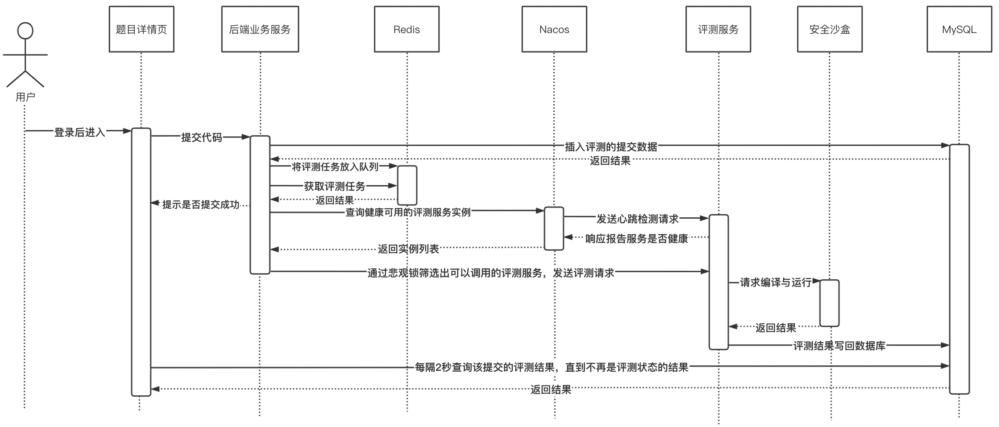
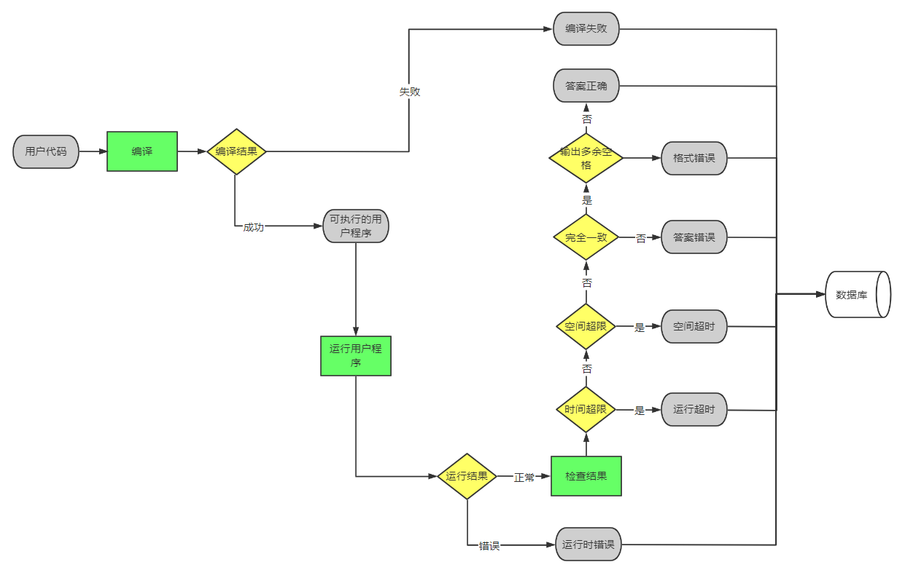
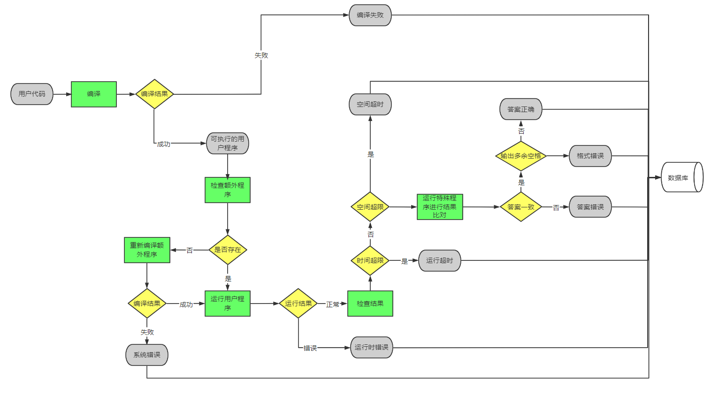
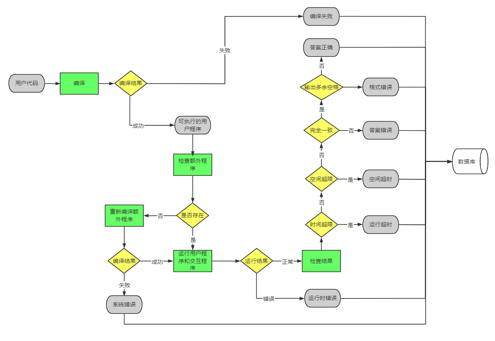
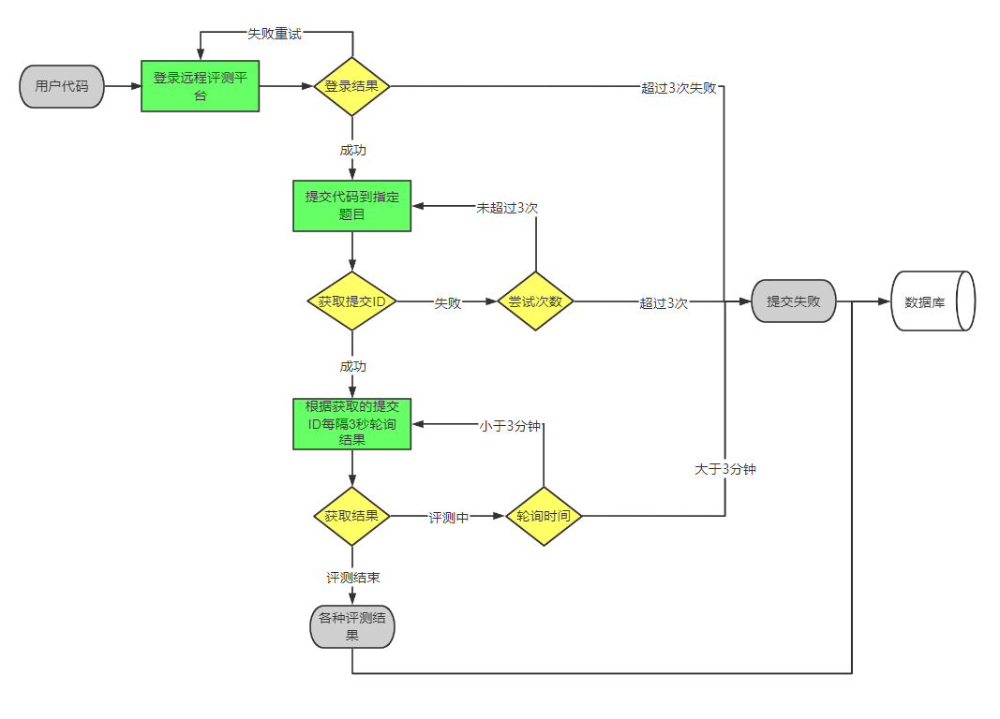

# 调度与评测

**评测的调用流程有如下步骤：**

1. 用户登录后进入指定题目的详情页，编辑完代码后提交；
2. 后端业务服务接收到提交信息后，校验提交数据后写入到MySQL数据库；
3. 写入数据库成功后，将该评测任务放入到Redis的等待评测队列中，然后返回告知用户已经成功提交；
4. 接着取出Redis中的等待评测队列头部的任务，查询Nacos获取健康可用的评测服务实例列表，通过悲观锁控制并发资源的调度，发送评测请求到有空闲评测资源的评测服务实例；
5. 评测服务接受到调用评测请求后，将通过Http请求先后调用安全沙盒（Go-Judge）进行用户代码的编译与运行，根据每个评测点数据的运行结果，得出最终评测结果写回到数据库。
6. 在这个过程中，用户在题目详情页提交成功代码后，前端页面将开启每2秒查询一次结果的定时器，直至该提交的评测的最终状态不再是评测中结束。

!!! note

    HOJ有四种评测模式：普通评测、特殊评测、交互评测、远程评测，具体的介绍请看文档： [判题模式](/use/judge-mode/)

### 一、普通评测

**普通评测**: 先调用安全沙盒服务编译用户提交的代码，如果编译失败则直接结束，返回结果为编译失败，接着调用安全沙盒服务运行用户程序，传入题目标准输入文件的文件路径、题目运行时间限制、题目运行空间限制等参数，等待每个数据点的评测结束，比较每个数据点的时间和空间是否超过题目规定的时空限制，然后对比用户程序输出和题目标准输出得出最终的评测结果，写回数据库。

### 二、特殊评测

**特殊评测**: 先调用安全沙盒服务编译用户提交的代码，如果编译失败则直接结束，返回结果为编译失败，然后检查是否存在已经编译完成的特殊程序，否则需要先调用服务编译该特殊程序代码，如果编译失败，则返回结果为系统错误。接着运行用户程序读取每个标准输入文件，获得结果，判断时空是否超限，超限就返回时间超限或空间超限的结果，不然就运行特殊程序读取题目标准输入和标准输出、用户程序的输出文件，对比后得出评测结果，写回数据库。

### 三、交互评测

**交互评测**: 先调用安全沙盒服务编译用户提交的代码，如果编译失败则直接结束，返回结果为编译失败，然后检查是否存在已经编译完成的交互程序，否则需要先调用服务编译该交互程序代码，如果编译失败，则返回结果为系统错误。接着运行用户程序和交互程序，两者程序进行标准输出和标准输入流的交互，最后得出结果，写回数据库。

### 四、远程评测

**远程评测**: 目前本系统支持HDU、POJ、Codeforces、GYM、AtCoder、SPOJ等平台的题目评测，主要实现的原理是爬虫模拟技术，首先先使用远程平台的账户登录，获取登录账户的cookie，配置到提交代码的接口参数里面，同时填入用户提交的代码、对应的题号、编译语言等信息，请求提交结果后可能失败，这时候需要设置重试机制，但多次重试依旧提交失败，则直接将结果写回数据库，如果获取到该提交对应的ID，则将该ID交给任务线程池进行每3秒一次的查询结果轮询，如果超过3分钟没有得出结果，则判断为提交失败写回数据库，否则就根据结果映射转换成自己平台的结果写回数据库。